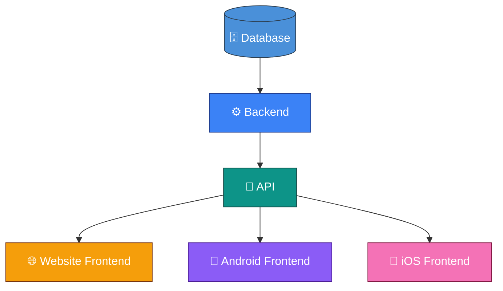
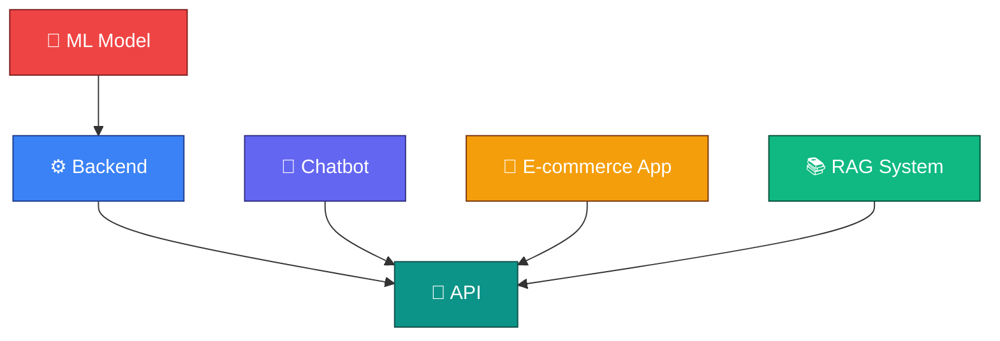
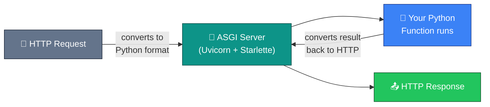
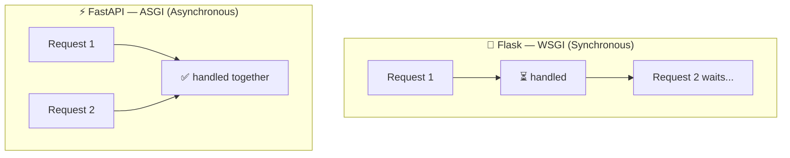
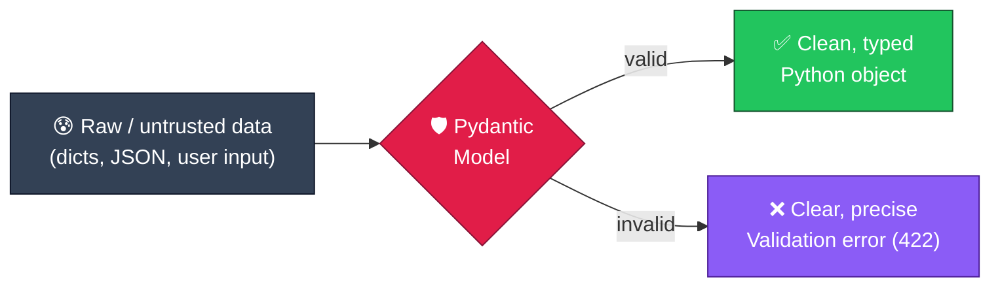

<h1 align="center">🏥 Patient Management System API</h1>

<p align="center">
  
</p>

<p align="center">
  <em>A CRUD REST API built with <a href="https://fastapi.tiangolo.com/">FastAPI</a> to manage patient records — created while learning API fundamentals and the FastAPI framework from the ground up.</em>
</p>

<p align="center">
  
  
  
  
</p>

---

## 📑 Table of Contents

- [About This Project](#-about-this-project)
- [What I Learned](#-what-i-learned)
  - [1. Why APIs Are Needed in Software Development](#1-why-apis-are-needed-in-software-development)
  - [2. Why APIs Are Needed in Machine Learning](#2-why-apis-are-needed-in-machine-learning)
  - [3. Why FastAPI Is *Fast to Run* and *Fast to Code*](#3-why-fastapi-is-fast-to-run-and-fast-to-code)
- [The Project](#-the-project-patient-management-system)
- [Concepts Practiced](#-concepts-practiced)
- [API Endpoints](#-api-endpoints)
- [Tech Stack](#-tech-stack)
- [Getting Started](#-getting-started)
- [Project Structure](#-project-structure)
- [Author](#-author)

---

## 🎯 About This Project

This repository is the practical outcome of my journey learning **API fundamentals** and the **FastAPI** framework.

I started by understanding *what* APIs are, *why* they are needed, and *why* FastAPI is considered fast — then I applied all of it by building a fully functional **Patient Management System API** that supports complete **CRUD** (Create, Read, Update, Delete) operations.

---

## 📚 What I Learned

### 1. Why APIs Are Needed in Software Development

Traditionally, applications were built using a **Monolithic Architecture** — where the **Frontend**, **Backend**, and **Database** all live inside a *single codebase*.

**The problem:** If you want to **share or sell your services** to others, you would have to hand over your entire backend or database — which is unsafe and impractical.

**The solution → API (Application Programming Interface):**

> An API is like a **public function** that others (and you) can call. Instead of exposing your database or backend directly, you expose *functions* (endpoints) like `/train` or `/book`. Anyone can call these functions to get results, while your actual backend and database stay **private and protected**.

This unlocks a huge advantage — **one backend can power many frontends**:



With APIs, you can build **one backend** and access it through **multiple frontends** — a website, an Android app, and an iOS app — all sharing the same logic and data. You can also add features like **authentication** on top, and even **monetize your services** without giving your code away.

> 💡 Real-world analogy: apps like *MakeMyTrip*, *Yatra*, and *ixigo* all consume the same railway/airline APIs to show you tickets — they don't own that data, they *call the API*.

---

### 2. Why APIs Are Needed in Machine Learning

The same idea applies to **Machine Learning** — just from an ML perspective.

**The problem (Monolithic ML app):** The **ML Model**, **Backend**, and **Frontend** are packed together (`model.pkl`, `ml_backend.py`, `app.py` all in one project). This makes the model impossible to reuse or share safely.

**The solution:** Wrap the ML model behind an **API layer**.



Once the model is served through an API:
- **Multiple applications** (chatbots, e-commerce like Amazon, RAG systems, etc.) can all send data to the model and get predictions back.
- The **same trained model** powers many products without being copied around.
- This is exactly why **FastAPI is extremely popular in ML/AI** — it's the bridge that turns a trained model into a usable service.

---

### 3. Why FastAPI Is *Fast to Run* and *Fast to Code*

FastAPI is built on **two powerful libraries**:

| Library | Role |
|---|---|
| 🌟 **[Starlette](https://www.starlette.io/)** | Handles how your API **receives HTTP requests** and **sends back responses** (the web/ASGI layer). This is what makes it **Fast to Run**. |
| 🛡️ **[Pydantic](https://docs.pydantic.dev/)** | Checks that incoming **data is correct and in the right format** (data validation). This is what makes it **Fast to Code**. |

#### ⚡ Fast to Run
When an HTTP request arrives, a **server gateway interface** converts the raw **HTTP request** into a Python-readable format, your function runs, and the Python result is converted back into an **HTTP response**.



FastAPI uses **[ASGI](https://asgi.readthedocs.io/)** (Asynchronous Server Gateway Interface) via **Starlette + [Uvicorn](https://www.uvicorn.org/)**. Unlike older frameworks such as **Flask** (which uses the synchronous *WSGI*), ASGI can handle requests **asynchronously** — meaning it doesn't sit idle waiting, and can serve **more requests concurrently**. That's why FastAPI benchmarks so much faster than Flask.

**Flask (WSGI) vs FastAPI (ASGI):**



#### 🧑‍💻 Fast to Code
Thanks to Pydantic and Python **type hints**, FastAPI gives you:
- ✅ **Automatic data validation** — bad data is rejected with a clear `422` error, no manual `if` checks needed.
- ✅ **Automatic interactive documentation** — free **[Swagger UI](https://swagger.io/tools/swagger-ui/)** and **ReDoc** generated from your code.
- ✅ **Less boilerplate** — you write a function, FastAPI handles parsing, validation, and serialization.

**How Pydantic validates every request:**



> This is exactly what happens in this project: raw JSON hits the `Patient` model → if valid you get a clean object (with `bmi` & `verdict` auto-computed), if not, FastAPI returns a helpful `422` error automatically.

---

## 🩺 The Project: Patient Management System

A REST API that manages patient records stored in a JSON file. Each patient has personal and health details, and the API can automatically compute health insights.

### Patient Data Model

Each patient record includes:

| Field | Type | Description |
|---|---|---|
| `id` | string | Unique patient ID (e.g. `P001`) |
| `name` | string | Patient name (auto-capitalized) |
| `city` | string | City of the patient |
| `age` | int | Age (must be between 1 and 120) |
| `gender` | male / female / other | Gender |
| `height` | float | Height in meters |
| `weight` | float | Weight in kilograms |
| `bmi` | float | ✨ **Auto-computed** from height & weight |
| `verdict` | string | ✨ **Auto-computed** health verdict (Underweight / Normal / Obese) |

> `bmi` and `verdict` are **computed fields** — the client never sends them; Pydantic calculates them automatically.

---

## 🧠 Concepts Practiced

This project was built specifically to practice core FastAPI building blocks:

- 🛣️ **[Path Parameters](https://fastapi.tiangolo.com/tutorial/path-params/)** — capturing values from the URL path, e.g. `/patients/view/{patient_id}`, with metadata via `Path(...)`.
- 🔍 **[Query Parameters](https://fastapi.tiangolo.com/tutorial/query-params/)** — optional/required filters like `/sort?sort_by=age&order=desc`, with metadata via `Query(...)`.
- 📦 **[Pydantic Models](https://fastapi.tiangolo.com/tutorial/body/)** — request-body validation using `BaseModel`, `Field`, `field_validator`, and `computed_field`.
- 🔄 **Partial updates** — a separate `UpdatedPatient` model with all-optional fields, using `exclude_unset=True` to update only what's sent.
- 🚦 **[HTTP status codes & error handling](https://fastapi.tiangolo.com/tutorial/handling-errors/)** — proper `HTTPException` responses (`404`, `400`, `201`, etc.).
- 🏷️ **Endpoint tags** — grouping routes (`Health`, `Patients`) for cleaner docs.

---

## 🌐 API Endpoints

| Method | Endpoint | Description |
|:---:|---|---|
| `GET` | `/` | Health check — returns *Hello, World!* |
| `GET` | `/about` | About message |
| `GET` | `/patients/view` | View **all** patients |
| `GET` | `/patients/view/{patient_id}` | View **one** patient by ID |
| `GET` | `/sort?sort_by=&order=` | Sort patients by `bmi` / `age` / `height` / `weight` |
| `GET` | `/patient/{patient_id}?field=` | Get a **single field** of a patient |
| `POST` | `/patient/create` | ➕ Create a new patient |
| `PUT` | `/patient/update/{patient_id}` | ✏️ Update an existing patient |
| `DELETE` | `/patient/delete/{patient_id}` | 🗑️ Delete a patient |

> Once the server is running, explore all of these live in the auto-generated docs at **`/docs`**.

### 📬 Example Requests & Responses

<details>
<summary><b>➕ POST</b> <code>/patient/create</code> — Create a new patient</summary>

**Request body**
```json
{
  "id": "P001",
  "name": "john doe",
  "city": "Mumbai",
  "age": 30,
  "gender": "male",
  "height": 1.75,
  "weight": 72
}
```

**Response** · `201 Created`
```json
{ "message": "Patient created successfully !!!" }
```
> `name` is auto-capitalized, and `bmi` + `verdict` are computed for you.

</details>

<details>
<summary><b>📋 GET</b> <code>/patients/view</code> — View all patients</summary>

**Response** · `200 OK`
```json
{
  "P001": {
    "name": "JOHN DOE",
    "city": "Mumbai",
    "age": 30,
    "gender": "male",
    "height": 1.75,
    "weight": 72,
    "bmi": 23.51,
    "verdict": "Normal"
  }
}
```

</details>

<details>
<summary><b>🔎 GET</b> <code>/patients/view/{patient_id}</code> — View one patient (Path Parameter)</summary>

**Request** → `GET /patients/view/P001`

**Response** · `200 OK`
```json
{
  "name": "JOHN DOE",
  "city": "Mumbai",
  "age": 30,
  "gender": "male",
  "height": 1.75,
  "weight": 72,
  "bmi": 23.51,
  "verdict": "Normal"
}
```

**If not found** · `404 Not Found`
```json
{ "detail": "Patient with ID P009 not found" }
```

</details>

<details>
<summary><b>↕️ GET</b> <code>/sort?sort_by=age&order=desc</code> — Sort patients (Query Parameters)</summary>

**Request** → `GET /sort?sort_by=bmi&order=asc`

**Response** · `200 OK`
```json
[
  { "name": "ALICE", "age": 25, "bmi": 19.4, "verdict": "Normal" },
  { "name": "JOHN DOE", "age": 30, "bmi": 23.51, "verdict": "Normal" }
]
```

**Invalid field** · `400 Bad Request`
```json
{ "detail": "Invalid sort_by value. Must be one of ['bmi','age','height','weight']" }
```

</details>

<details>
<summary><b>✏️ PUT</b> <code>/patient/update/{patient_id}</code> — Update a patient (partial update)</summary>

**Request** → `PUT /patient/update/P001`
```json
{ "weight": 80 }
```

**Response** · `200 OK`
```json
{ "message": "Pateint updated successfully !!" }
```
> Only the fields you send are updated — `bmi` & `verdict` are re-computed automatically.

</details>

<details>
<summary><b>🗑️ DELETE</b> <code>/patient/delete/{patient_id}</code> — Delete a patient</summary>

**Request** → `DELETE /patient/delete/P001`

**Response** · `200 OK`
```json
{ "message": "P001 deleted successfully !" }
```

</details>

---

## 🛠️ Tech Stack

- **[Python 3.14](https://www.python.org/)**
- **[FastAPI](https://fastapi.tiangolo.com/)** — web framework
- **[Pydantic](https://docs.pydantic.dev/)** — data validation
- **[Uvicorn](https://www.uvicorn.org/)** — ASGI server
- **JSON file** — lightweight data storage

---

## 🚀 Getting Started

> **Prerequisite:** [Python 3.10+](https://www.python.org/downloads/) installed on your machine.

### 1. Clone the repository
```bash
git clone https://github.com/<your-username>/patient-management-api.git
cd patient-management-api
```

### 2. Create a virtual environment
```bash
python -m venv myvenv
```

### 3. Activate the virtual environment
```bash
# Windows (PowerShell / CMD)
myvenv\Scripts\activate

# macOS / Linux
source myvenv/bin/activate
```

### 4. Install dependencies
```bash
pip install -r requirements.txt
```
> Installs the exact versions from [`requirements.txt`](requirements.txt) — **FastAPI**, **Uvicorn**, and **Pydantic** (plus their sub-dependencies).

### 5. Run the server
```bash
uvicorn main:app --reload
```
> `--reload` auto-restarts the server whenever you edit the code — handy during development.

### 6. Open the interactive docs
Once the server is running, visit:
- 🧪 **Swagger UI** → [http://127.0.0.1:8000/docs](http://127.0.0.1:8000/docs)
- 📘 **ReDoc** → [http://127.0.0.1:8000/redoc](http://127.0.0.1:8000/redoc)

---

## 📁 Project Structure

```
fastapi-learning-journey/
├── main.py                      # FastAPI app + all API endpoints
├── patients.json                # Patient data (JSON storage)
├── requirements.txt             # Project dependencies
├── .gitignore                   # Files git should ignore (venv, cache, etc.)
├── README.md                    # You are here 📍
└── models/
    ├── __init__.py              # Marks models as a Python package
    ├── Patient_model.py         # Patient Pydantic model (with computed BMI & verdict)
    └── update_patient_model.py  # UpdatedPatient model (all fields optional)
```

---

## 👤 Author

Made with ❤️ while learning **FastAPI**.

> This project marks my first milestone in backend & API development — from understanding *why* APIs exist to actually *building* one.

---

⭐ If you found this helpful or interesting, consider giving the repo a star!
